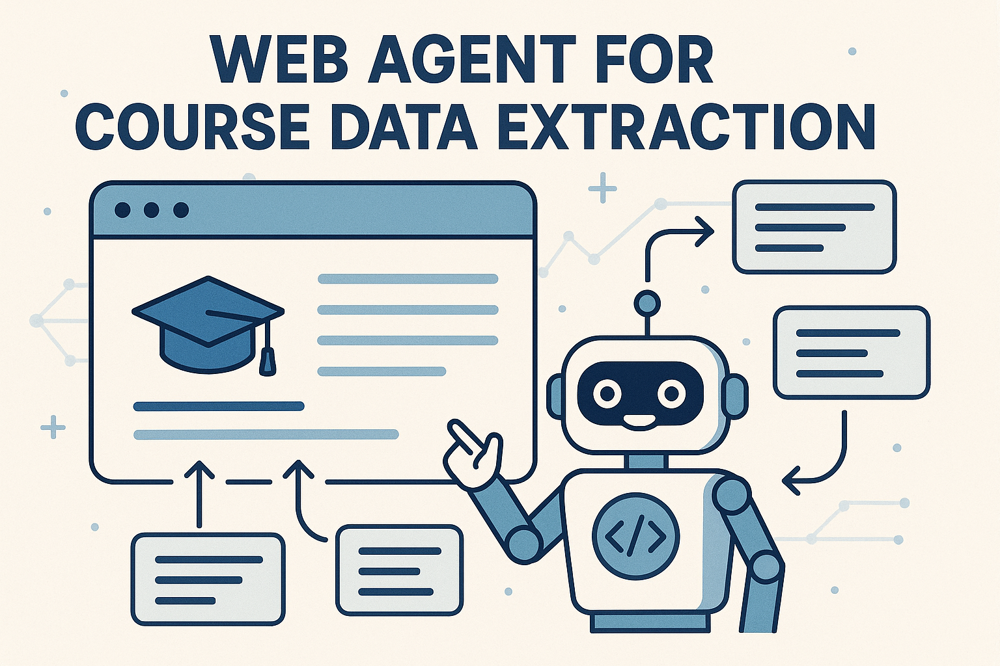

# Web Agent for Course Data Extraction

## Project Description

This project involves building an intelligent web agent capable of scraping and analyzing content from online educational platforms. The agent uses Playwright for dynamic web scraping, capturing HTML content and screenshots, and employs OpenAI's language models to extract and structure relevant information such as course titles, descriptions, presenters, image URLs, and course URLs. 

The system allows for filtering and searching specific types of courses, such as Retrieval Augmented Generation (RAG) courses, and visualizes the extracted data for easy review. This automation facilitates efficient collection and organization of online educational content.

## Different Steps of the Project

### 2. Launching the Web Browser
- Create a `WebScraperAgent` class to manage browser automation.
- Initialize a headless Chromium browser using Playwright.
- Open a new page for web scraping.

### 3. Web Content Scraping
- Navigate to the target URL.
- Wait for the page to load completely, including dynamic content.
- Extract the HTML content of the page.
- Take a screenshot of the page for visualization.

### 4. Data Processing
- Convert the HTML content into a structured format.
- Use a language model (LLM) to analyze the HTML and extract key information:
  - Course title
  - Description
  - Presenters
  - Image URL
  - Course URL
- Store the extracted data in a predefined structured format.

### 5. Filtering and Specific Search
- Define instructions for specific searches (e.g., courses related to RAG).
- Send the HTML content and instructions to the LLM for processing.
- Retrieve filtered or targeted course data.

### 6. Visualization and Presentation
- Display the structured data in a readable format.
- Show the associated screenshots.
- Enable interactive exploration of the extracted information.

### 7. Error Handling and Cleanup
- Manage exceptions to ensure robustness.
- Close the browser and stop the Playwright session after each operation.

